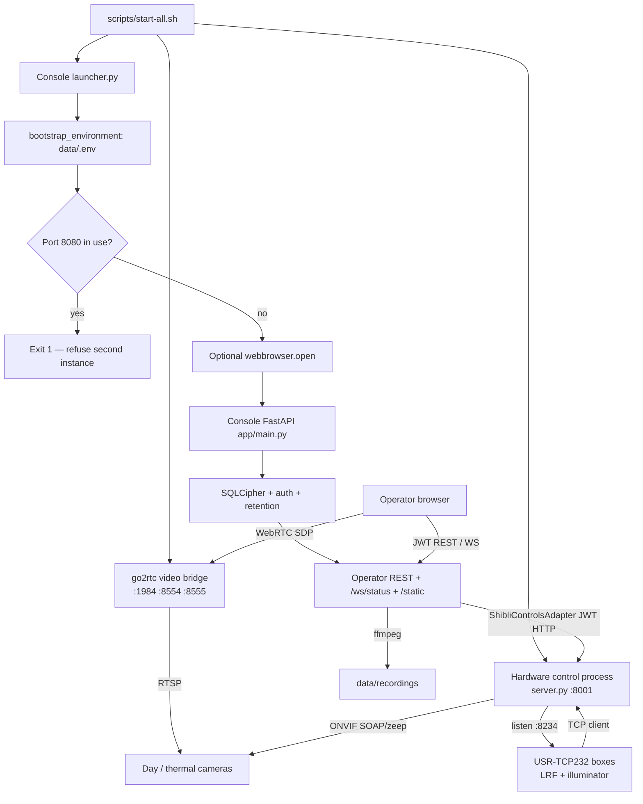

# SHIBLI C2 — Current-State Audit

**Audit date:** 2026-09-05 (hardware-control section expanded 2026-09-11)  
**Audited tree:** `<SHIBLI_SOURCE_ROOT>` (console) plus the hardware-control sources that this installation is configured to start  
**Method:** source and configuration inspection, plus isolated unit tests. No startup, migration, hardware, or installer commands were run against operational data. Existing in-repo documentation was treated as claims to verify.

This report describes SHIBLI C2 as it actually runs: an operator console plus its hardware-control and video-bridge processes. Implementation status is separate from hardware or field verification.

---

## 1. Concise summary

SHIBLI C2 Phase 1 is a **multi-process Command & Control application**, not a single Python file and not three unrelated products. The operator uses one browser UI. Behind that UI the stack is:

| Process | Role in SHIBLI C2 | Default |
|---------|-------------------|---------|
| **Console** (`launcher.py` / `app/main.py`) | Login, screens, SQLCipher DB, camera records, recording, and the public REST/WebSocket API | `:8080` |
| **Hardware control** (`SHIBLI-controls` / `server.py`) | ONVIF PTZ/focus/presets and USR TCP for LRF/illuminator. The console starts this process and sends every turret command through it. | `:8001` HTTP, `:8234` USR |
| **Video bridge** (go2rtc) | Pulls camera RTSP and serves WebRTC to the browser. The console generates its YAML from camera records. | `:1984` / `:8554` / `:8555` |

The console stores users, cameras, settings, recordings metadata, and audit logs in a **SQLCipher-encrypted** file database. Live video is **not decoded in the console**; the browser negotiates WebRTC with go2rtc. PTZ, LRF, illuminator, and related device I/O are **not implemented inside `app/`** — they are the hardware-control process, driven by `ShibliControlsAdapter`. Recording uses **ffmpeg** as a subprocess of the console.

Operators do not log into the hardware-control process. `./scripts/start-all.sh` starts all three pieces and reports PASS/FAIL from HTTP health. `./scripts/start-controls.sh` is how the console locates and launches the control process (`SHIBLI_CONTROLS_DIR`). On this lab that directory is set in `data/.env` to a sibling SHIBLI-controls tree (path name omitted here). The control sources are **not copied into** `ShibliC2_full/`; they are still **part of the running application**, the same way go2rtc is.

The current execution model is **source + virtualenv + launcher**, not a dedicated desktop WebView. `launcher.py` can open the system browser; Ubuntu `scripts/start.sh` sets `SHIBLI_NO_BROWSER=1` and leaves the operator to open `http://127.0.0.1:8080`. There is **no Tauri, Electron, Docker runtime, PostgreSQL, or ONNX** in the inspected console sources. Windows one-file and Linux binary packaging are **defined** for the console only (`ShibliC2.spec`) and **do not bundle** the hardware-control process or go2rtc. Offline “download, install, and run” is **not demonstrated**.

Application version in the console is **`1.2.2-hw`**. The hardware-control FastAPI app reports **`2.0.0`**. In-repo docs still show older console version strings. There are **no Git tags** on the console repo. There is **no in-app updater**.

---

## 2. Repository and application identity

| Item | Value | Source |
|------|--------|--------|
| Repository root | `<SHIBLI_SOURCE_ROOT>` | `git rev-parse --show-toplevel` |
| Branch | `phase1-qurrat-work` | `git branch --show-current` |
| HEAD | `2ab4ab81392585b5d4ee5d23919dd22d4ed897cf` | `git rev-parse HEAD` |
| Tip commit | Merge of `cursor/phase1-release-2648` (2026-09-01) | `git log -1` |
| Remote | `https://github.com/Qurratulain25/ShibliC2.git` | `git remote -v` |
| Git tags | none | `git tag -l` |
| App version | `1.2.2-hw` | `app/main.py` L45 |
| Docs version claim | `"1.2.0-phase1"` in health example | `DEPLOYMENT.md` L143 |
| Sidebar placeholder | `v1.0.0` until `/api/status` arrives | `static/index.html` L91; `static/js/app.js` L1102–1105 |

### Working tree

29 tracked files are modified. `git diff --ignore-cr-at-eol --numstat` reports **0 content insertions and 0 content deletions**. The dirty tree is **CRLF line-ending noise**, not functional uncommitted features. This audit describes the file contents as they exist on disk (same logic as HEAD).

### Active implementation vs other material

| Kind | What exists | Role |
|------|-------------|------|
| Active app | `launcher.py`, `app/`, `static/` | Runtime |
| Install/start scripts | `scripts/` | Ubuntu/Windows helper scripts |
| Packaging definitions | `ShibliC2.spec`, `build.ps1`, `scripts/build-linux.sh`, `scripts/package-release.sh`, `scripts/package-demo.sh` | Build/copy recipes; no built `dist/` here |
| Service template | `deploy/shibli-c2.service` | systemd unit for a Linux binary at `/opt/shibli-c2/dist/ShibliC2` |
| In-tree docs (claims) | `README.md`, `ARCHITECTURE.md`, `DEPLOYMENT.md`, `DATABASE.md`, `CAMERA_INTEGRATION_CHECKLIST.md` | Verified against code below |
| Tests | `tests/` (5 Python modules + `smoke_check.sh`) | Isolated unit tests pass; smoke needs a live stack |
| Hardware-control sources | Not inside `ShibliC2_full/`; located at runtime by `SHIBLI_CONTROLS_DIR` / `start-controls.sh` | Device I/O process of the same C2 stack (see §3.1) |
| Not in the console tree | `.github/`, `LICENSE`, `dist/`, `bin/go2rtc`, `app/panorama/`, Dockerfiles, map/model assets | See §14 |
| Claimed elsewhere | Phase 2/3 on branch `cursor/phase-2-3-future-2648` under `future/` | `README.md` L59; **not present in this tree** |

Sibling Desktop copies of the **console** are not the source of truth for this audit. The hardware-control tree that **this** `data/.env` starts **was** inspected as the device-control process of SHIBLI C2.

### Entry points

| Entry | Behaviour |
|-------|-----------|
| `launcher.py` | Load env, copy `go2rtc.yaml.example` if needed, refuse a second listener on `VMS_PORT`, optionally `webbrowser.open`, then `uvicorn.run(app)` |
| `app/main.py` | FastAPI app, lifespan (SQLCipher, auth/DB, retention), routes, `/static` |
| `scripts/start.sh` | `ensure-ready.sh` + venv Python + `launcher.py` with `SHIBLI_NO_BROWSER=1` |
| `scripts/start-all.sh` | Full SHIBLI C2 stack: hardware control + go2rtc + console; PASS/FAIL from HTTP, not PIDs |
| `scripts/start-controls.sh` | Starts the hardware-control process (`server.py`) on `:8001` and USR TCP on `:8234` |
| `python launcher.py` / `dist/ShibliC2` | Documented Windows/Linux binary entry (`ShibliC2.spec` L29, L47–67, `console=True`) |

### Major directories

| Path | Responsibility |
|------|----------------|
| `app/core/` | Env bootstrap, paths, config, SQLCipher, settings, UI module list |
| `app/auth/` | JWT, bcrypt, role/permission checks |
| `app/adapters/` | Console-side driver for the hardware-control process (`ShibliControlsAdapter`, singleton `gateway`) |
| `app/routes/` | Auth, cameras, backend proxy, media/diag, settings/recordings |
| `app/services/` | go2rtc render, ffmpeg recording, camera test, Core/Controls sync, retention |
| `static/` | Operator console (HTML/CSS/JS modules) |
| `scripts/` | Install, start/stop, diagnose, package, verify |
| `data/` | Runtime env, encrypted DB, recordings, logs (gitignored secrets/DB) |
| `deploy/` | systemd unit template |

---

## 3. Architecture and technology stack

### Stack actually present

| Layer | Technology | Where it lives |
|-------|------------|----------------|
| Frontend | Vanilla JS ES modules, `static/index.html`, `static/css/styles.css` | Console tree |
| Operator API | FastAPI 0.115.6 + Uvicorn 0.34.0 | Console `app/main.py` |
| Database | SQLCipher via `sqlcipher3` | Console `app/core/db_engine.py` |
| Hardware control | FastAPI 2.0.0 + Uvicorn; ONVIF (`onvif-zeep`) + USR TCP | `SHIBLI-controls` (`server.py`), started by C2 scripts |
| Video bridge | go2rtc process; console renders YAML | Sidecar binary |
| Desktop | System browser (`webbrowser`) or operator-opened URL | Console `launcher.py` |
| Recording | ffmpeg subprocess (`-c copy` or lavfi testsrc) | Console `recording_engine.py` |
| Build (console) | PyInstaller 6.11.1 | `ShibliC2.spec` — does **not** pack hardware control or go2rtc |

Not found in either process: Tauri, Electron, React/Vue, PostgreSQL, ONNX, GIS map UI. Docker comments exist in the hardware-control USR module but **no Docker runtime** is in the console tree.

### Startup sequence (as coded)



`ARCHITECTURE.md` L3 calls Phase 1 a **single process**. That describes only the console. The product as started in the field is **three cooperating processes** (`start-all.sh` L1–3, L77–117).

### 3.1 Hardware control process (part of SHIBLI C2)

This is the device-control layer of SHIBLI C2. The operator never opens it. The console starts it, registers cameras into it, and forwards dashboard PTZ/LRF/illuminator actions to it.

**How this installation finds it.** `scripts/start-controls.sh` uses `SHIBLI_CONTROLS_DIR` from `data/.env`, then falls back to a list of sibling/lab folders that contain `server.py`. This lab’s `data/.env` sets `SHIBLI_CONTROLS_DIR` to a Desktop sibling tree (not the `ShibliC2_full` git root). A second copy also exists under a packaged setup folder. The control tree has **no `.git` directory**. Console packaging (`package-release.sh`, `ShibliC2.spec`) does **not** include these sources, which is a packaging gap, not a separate product.

**Identity (inspected copy this lab starts)**

| Item | Value |
|------|--------|
| Entry | `server.py` → `uvicorn.run(app, host="0.0.0.0", port=PORT)` |
| Declared version | FastAPI `version="2.0.0"` (`server.py` L84–88) |
| Role printed at boot | “ONVIF Camera Control Service” (`server.py` L19) |
| HTTP | `0.0.0.0:{PORT}` default **8001**; `GET /health` is public |
| API prefix | `/api/camera/...` (`server.py` L113) |
| Layout | `routes/`, `controllers/`, `services/`, `middleware/auth.py`, `config.py` |

**What it does**

1. **ONVIF camera I/O** — `services/camera_service.py` uses `onvif.ONVIFCamera` (`onvif-zeep==0.2.12`, `zeep==4.3.0`). WSDL files come from that package (`ptz.wsdl`, `imaging.wsdl`, `devicemgmt.wsdl`, `media.wsdl`, …), not from the console tree. Camera id format is `{ip}:{onvif_port}` (default port 80), which is exactly what the console writes when saving a camera (`app/services/controls_sync.py` L13–21).
2. **Hold-to-move PTZ** — `ContinuousMove` until `Stop` (`camera_service.py` L221–260, `stop_movement` L311). Matches the console’s `/api/ptz/start` and `/api/ptz/stop`.
3. **Step PTZ / home / zoom** — timed `ContinuousMove` and home; motor speed is a 0–1 scale mapped from the console’s low/medium/high percentages.
4. **Focus** — ONVIF imaging `SetImagingSettings` AutoFocusMode AUTO/MANUAL, and imaging `Move` for near/far (`camera_service.py` L513–535). Routes: `POST /api/camera/focus/mode|near|far|stop`. There is **no** `POST /api/camera/focus/auto` on this control process; the console day-AFC path still posts `focus/auto` (`shibli_controls.py` L583). Thermal AFC correctly uses `focus/mode`.
5. **Presets / auto-pan** — stored in the control process `data/presets.json`; HTTP is `/api/camera/presets` and `/api/camera/autopan/start|stop`. The console adapter still posts `preset/set/{n}`, `preset/go/{n}`, `preset/delete/{n}` (`shibli_controls.py` L594–598), which **do not match** those routes.
6. **LRF** — USR-TCP232 box connects **into** the control process as a TCP client. Prefix `2F 03 07`. Hex commands in `LRF_IMPLEMENTATION.md` (single range, continuous, stop). Console: register + `lrf/single-range` + `lrf/continuous/start|stop`. Console distance poll uses `GET lrf/distance`; control routes expose `GET /api/camera/lrf/get-distance`.
7. **Illuminator** — second USR client, prefix `2F 04 07`. Console maps brightness/FOV to `illuminator`, `illuminator/brightness`, `illuminator/fov`. Day cameras are registered with `illuminator_ip` / TCP 8234; thermal cameras are not (`controls_sync.py` L23–28).
8. **USR listener** — TCP server default bind `USR_SERVER_IP` / `USR_SERVER_PORT` (`config.py` L39–46). `start-controls.sh` rebinds to `0.0.0.0` if the configured PC IP is not on this host. Default device IPs in control `config.py`: LRF `192.168.0.128`, illuminator `192.168.0.7` (site-specific; not secrets).
9. **Thermal image** — polarity / brightness / contrast via ONVIF imaging (`/polarity`, `/brightness`, `/contrast`). Console `/api/thermal/image` maps onto those.
10. **Camera-firmware tracking toggle** — `POST /api/camera/tracking` calls `set_tracking`, which tries ONVIF `SetConfiguration` and on failure **stores a local flag and still returns success** (`camera_service.py` L1267–1298). The **console UI does not call this**. It is not a yellow-box tracker in the C2 dashboard.

**What the console sends that this control process does not expose**

| Console POST (`/api/camera/{path}`) | Control routes inspected |
|-------------------------------------|--------------------------|
| `wiper`, `heater`, `nuc`, `agc` | **not found** in `camera_routes.py` |
| `focus/auto` (day AFC) | **not found**; use `focus/mode` |
| `preset/set\|go\|delete/{n}` | **not found**; use `/presets` |
| `GET lrf/distance` | **not found**; use `lrf/get-distance` |

Those dashboard buttons are wired in the console; they will fail against this control process unless simulate/fallback is on.

**Auth between console and hardware control**

Both processes verify **HS256 JWT** with a shared secret. The console mints a token (`username=shibli-local`, `roleName=ADMINISTRATOR`, `control-camera` among permissions) if `SHIBLI_API_TOKEN` is empty (`shibli_controls.py` L187–199). `start-controls.sh` L67 exports `JWT_SECRET` from `SHIBLI_JWT_SECRET`. Control `middleware/auth.py` requires Bearer JWT and `control-camera`. Register/default-camera routes require ADMINISTRATOR. `/health` has no auth.

**Dependencies of the hardware-control process** (`SHIBLI-controls/requirements.txt`)

| Package | Pin |
|---------|-----|
| fastapi | 0.104.1 |
| uvicorn | 0.24.0 |
| python-dotenv | 1.0.0 |
| PyJWT | 2.8.0 |
| onvif-zeep | 0.2.12 |
| zeep | 4.3.0 |
| pyserial | 3.5 |
| legacy-cgi | >=2.6 |

Its own venv is preferred (`SHIBLI-controls/venv/bin/python3`). `scripts/fix-controls-venv.sh` repairs that venv after copying from another PC.

**Lifecycle**

- Start: `start-all.sh` or `start-controls.sh` (kills prior listeners on 8001 and 8234 first).
- Stop: `stop-all.sh` / `stop-controls.sh` (ports 8001 + 8234).
- Shutdown of `server.py` disconnects ONVIF cameras and stops the USR TCP server (`server.py` L71–82).
- Closing the **browser** does not stop this process.
- Console lifespan does **not** send PTZ stop into this process.

**Optional SHIBLI-Core:** control `config.py` still mentions Core as a camera registry. Phase 1 C2 registers cameras itself from `local_cameras` (`controls_sync.py`). Core (`:3000`) is optional.

### Communication mechanisms that exist in code

| Mechanism | Use | Location |
|-----------|-----|----------|
| HTTP REST | Operator API | `app/main.py`, `app/routes/*` |
| WebSocket | Status/telemetry push every ~2s | `app/main.py` L379–446; client `static/js/app.js` L1679–1696 |
| Browser → go2rtc HTTP | WebRTC SDP exchange | `static/js/webrtc.js` L34–40; `apiBase` from `/api/go2rtc/config` |
| C2 → go2rtc HTTP | Stream list / health | `app/services/go2rtc.py` L21–43 |
| Console → hardware-control HTTP | PTZ/LRF/illuminator/aux (JWT) | `app/adapters/shibli_controls.py` L224–244 |
| Hardware control → camera | ONVIF SOAP via zeep (`ContinuousMove`, imaging, presets) | `SHIBLI-controls/services/camera_service.py` |
| USR boxes → hardware control | TCP clients on `:8234`, device prefixes `2F 03 07` / `2F 04 07` | `SHIBLI-controls/services/usr_connection.py` |
| Console → SHIBLI-Core / VSS HTTP | Optional registry/VSS proxy | `app/services/shibli_client.py` |
| ffmpeg subprocess | Recording | `app/services/recording_engine.py` L59–102 |
| TCP connect | Camera “Test Connection” (console, not ONVIF move) | `app/services/camera_test.py` L19–27 |

There is **no** FastAPI route `/api/webrtc`. The browser talks to **go2rtc’s** `/api/webrtc` using `cfg.api_url` (default `http://127.0.0.1:1984`).

### CORS and OpenAPI

FastAPI enables `CORSMiddleware` with `allow_origins=["*"]` (`app/main.py` L142–148). Interactive docs are at `/api/docs` (`app/main.py` L140).

---

## 4. Dependencies and runtime requirements

### Declared Python constraints (`requirements.txt`)

| Package | Constraint | Observed in this machine’s `.venv` |
|---------|------------|-------------------------------------|
| fastapi | `==0.115.6` | 0.115.6 |
| uvicorn[standard] | `==0.34.0` | 0.34.0 |
| pydantic | `==2.10.4` | 2.10.4 |
| python-dotenv | `==1.0.1` | present (import OK; version not separately printed) |
| httpx | `==0.28.1` | 0.28.1 |
| PyJWT | `==2.8.0` | 2.8.0 |
| bcrypt | `==4.2.1` | 4.2.1 |
| sqlcipher3 | `>=0.5.4` | importable (`present`; no `__version__`) |
| pyinstaller | `==6.11.1` | declared; not invoked this audit |

There is **no** `requirements.lock` / `poetry.lock` / `uv.lock` in the tree. Locked versions are the `==` pins above; `sqlcipher3` is a floor only.

### Host / native / external

| Dependency | How obtained | Declared / observed |
|------------|--------------|---------------------|
| Python 3 | OS / venv (`install-ubuntu.sh` L9–15) | Observed: **Python 3.13.7** |
| libsqlcipher-dev | `apt` on Ubuntu | Required to build/use `sqlcipher3`; not bundled |
| ffmpeg | OS package (`DEPLOYMENT.md` L86) | Observed: **ffmpeg 7.1.1-1ubuntu4.2** at `/usr/bin/ffmpeg` |
| go2rtc | Manual download; PATH, `GO2RTC_BIN`, `/usr/local/bin/go2rtc`, or `bin/go2rtc` | Observed: **go2rtc 1.9.14 linux/amd64** at `/usr/local/bin/go2rtc`. **`bin/go2rtc` not in repo** |
| Hardware-control process | Own venv + `requirements.txt`; started by C2 | Located via `SHIBLI_CONTROLS_DIR`. Pins: FastAPI 0.104.1, onvif-zeep 0.2.12, zeep 4.3.0, pyserial 3.5. **Not copied into `ShibliC2_full/`** |
| Browser | OS | Chrome/Firefox/Edge assumed; not specified |
| STUN | Runtime to `stun:stun.l.google.com:19302` | `go2rtc.yaml.example` L16; `static/js/webrtc.js` L8; `app/services/go2rtc.py` L165 |

### Resource files

| Resource | Bundled? | Notes |
|----------|----------|-------|
| `static/` HTML/CSS/JS | Yes (source and PyInstaller `datas`) | `ShibliC2.spec` L32–36 |
| `config.example.json`, `.env.example` | Yes | Copied to `data/` on first writable run |
| `go2rtc.yaml.example` | Yes | Live `go2rtc.yaml` generated/copied; gitignored |
| ONVIF WSDL | In the hardware-control venv (`onvif-zeep` `wsdl/*.wsdl`) | Console camera-test only GETs `/onvif/device_service`; PTZ uses the control process |
| Certificates | **not found** | HTTP only in C2; TLS not configured here |
| Map tiles / GIS assets | **not found** | `streams.map` is an empty config string |
| ML / ONNX models | **not found** | — |
| Icons | **not found** | `ShibliC2.spec` `icon=None` L66 |
| LICENSE / redistributable notices | **not found** | No `LICENSE` file |

### CPU / GPU / licence

| Topic | Evidence |
|-------|----------|
| CPU/GPU requirements | **Unknown.** No performance or hardware spec in repo. `ARCHITECTURE.md` L10 says “CPU-first”. |
| GPU / CUDA | **not found** |
| Redistribution / licence | **not found** in-repo. go2rtc and ffmpeg licences are those of the upstream projects; not copied here. |
| Installer size / RAM / latency | **not measured** this audit |

### Bundled vs downloaded

| Class | Items |
|-------|--------|
| Bundled in console source tree | Console Python, static UI, examples, start/stop scripts for the whole stack |
| Bundled in PyInstaller EXE (if built) | Console runtime + static/examples; **not** go2rtc, ffmpeg, or the hardware-control tree (`ShibliC2.spec`) |
| Hardware-control tree | FastAPI ONVIF/USR process + its venv (must sit where `SHIBLI_CONTROLS_DIR` points) |
| OS / apt | python3, venv, pip, libsqlcipher-dev, ffmpeg (manual) |
| Downloaded at setup | `pip install -r requirements.txt` in **both** the console venv and the hardware-control venv |
| Downloaded at runtime | WebRTC STUN to Google (if ICE uses it); no app auto-update download |
| Operator-supplied | go2rtc binary, camera RTSP, USR boxes, `SHIBLI_DB_KEY`, matching JWT secret |

---

## 5. Implemented functionality

### Screens (hash router)

`static/js/router.js` L3: **dashboard, recordings, cameras, users, audit, settings**. Users and audit are admin-only in the router (L28–29). Module metadata matches `app/core/modules.py` L6–51.

Login and forgot-password are full-screen forms in `static/index.html` L40–73, not hash pages.

### Feature evidence table

Status values: **implemented in code** | **partial / simulated path** | **UI only / disconnected** | **not found in inspected sources**.  
Verification: **isolated unit tests** | **source inspection only** | **not runtime-verified**.

| Area | Actual behaviour | Implementation status | Verification evidence | Source file and line | Limitation |
|------|------------------|----------------------|----------------------|----------------------|------------|
| Login / JWT | Username/password → bcrypt check → HS256 JWT; token in `localStorage` | implemented in code | source inspection only | `app/auth/service.py` L38–111; `static/js/api.js` L1–10 | Session is bearer JWT in localStorage, not httpOnly cookie |
| First admin | Empty DB seeds user from `SHIBLI_DEFAULT_ADMIN_*` or create-first-admin API | implemented in code | source inspection only | `app/auth/service.py` L164–180; `app/routes/auth.py` L52–54 | Default pair is documented in README/.env.example |
| Forgot password | Recovery code compared to `SHIBLI_PASSWORD_RECOVERY_CODE`; recovery is disabled when no code is configured | implemented in code | source inspection only | `app/auth/service.py` L147–161 | Configured shared recovery code; reset is disabled when recovery is not configured |
| Users / roles | ADMINISTRATOR / OPERATOR / VIEWER; CRUD, disable, reset password, camera assignment | implemented in code | source inspection only | `app/core/database.py` L32–42; `app/routes/auth.py` L79–213 | Delete is deactivate |
| Permissions | `require_permission` / `require_roles` on most mutating APIs | implemented in code | source inspection only | `app/auth/service.py` L77–92 | `/api/backend/status` has no auth (`app/routes/backend.py` L78–80) |
| Day / thermal video | WebRTC via go2rtc; MJPEG fallback if URL looks like mjpeg | implemented in code | source inspection only | `static/js/app.js` L752–786; `static/js/webrtc.js` L3–47 | Needs go2rtc + reachable RTSP; reconnect every 5s on fail |
| Camera CRUD | Local cameras in SQLCipher; host may be LAN IP or hostname | implemented in code | isolated unit tests for host/RTSP parse | `app/routes/cameras_route.py` L35–98; `tests/test_camera_test_host.py` | Passwords stored in `local_cameras` (encrypted DB file) |
| Camera test | TCP to RTSP port; optional HTTP GET ONVIF device_service | implemented in code (reachability) | isolated mocks pass | `app/services/camera_test.py` L41–104 | Does **not** decode video or run full ONVIF; success can mean “port open” |
| Core → Controls sync | Proxies Core cameras and local cameras into controls register APIs | implemented in code | source inspection only | `app/routes/backend.py` L31–75; `app/services/backend_sync.py` | Needs Core + Controls online; checklist mentions Docker (not in this repo) |
| PTZ hold-to-move | mousedown/touchstart → `/api/ptz/start`; mouseup/leave/touchend → `/api/ptz/stop` | implemented in code | source inspection only | `static/js/app.js` L1356–1422; `app/main.py` L276–297 | Stop on tab close / app shutdown **not found** |
| PTZ home / stop button | Click → move home or stop | implemented in code | source inspection only | `static/js/app.js` L1358–1386 | Hardware path unverified |
| Zoom hold | Same start/stop as PTZ | implemented in code | source inspection only | `static/js/app.js` L1458–1463 | Delegated to controls `start-zoom-*` / `stop` |
| Near/far focus | Hold → `/api/ptz/focus/start` near/far; release → focus/stop | implemented in code | source inspection only | `static/js/app.js` L1466–1473; `app/routes/media_route.py` L134–153 | Hardware unverified |
| Autofocus | Thermal: `focus/mode` on thermal camera id. Day: console posts `focus/auto` | partial | isolated unit tests **pass** for targeting; day route mismatch | `shibli_controls.py` L573–588; control `camera_routes.py` has `focus/mode` only | Day AFC path may 404 against this control process; tests mock HTTP |
| Presets | Console posts `preset/set\|go\|delete/{n}`; control process uses `/presets` and `/presets/{id}/go` | partial / path mismatch | source inspection only | adapter L590–598 vs `camera_routes.py` L364–396 | Hardware unverified; route names do not match |
| Auto-pan | UI interval of relative `/api/ptz/move` every 2.2s **and** `/api/ptz/auto-pan` → controls autopan | implemented in code (dual path) | source inspection only | `static/js/app.js` L721–737; adapter L524–537 | Two mechanisms; field behaviour unverified |
| Region drag-zoom | Yellow selection rectangle; CSS zoom + optional `zoom_in` lens nudge | implemented in code | source inspection only | `static/js/drag-zoom.js`; `static/js/app.js` L1654–1663 | **Not object tracking** |
| LRF single | Console → hardware-control `lrf/single-range` → USR hex | implemented in code | source inspection only | adapter L683–718; `lrf_service.py` | Simulate uses `random.randint(850, 2400)` L689 |
| LRF continuous | start/stop; console polls `lrf/distance`, control exposes `lrf/get-distance` | partial (poll path mismatch) | source inspection only | `media_route.py` L188–215 vs `camera_routes.py` L623 | Live ranging unverified |
| Illuminator | enable / brightness / FOV → USR prefix `2F 04 07` | implemented in code | source inspection only | adapter L727–782; `illuminator_service.py` | Hardware unverified |
| Wiper / heater / NUC / AGC | Console `/api/quick` posts those paths; **not present** on inspected hardware-control router | UI + console adapter only | source inspection only | adapter L784–839; `index.html` L315–317 | Will fail unless simulate/fallback; checklist marks NUC/AGC as Phase 2+ |
| Thermal polarity / brightness / contrast | `/api/thermal/image` | implemented in code | source inspection only | `app/routes/media_route.py` L174–185 | Hardware unverified |
| OSD | Toggle + config stored in runtime + settings | implemented in code (UI overlay) | source inspection only | `app/main.py` L240–263 | Overlay in browser, not burned into RTSP |
| Layouts | day_thermal / day_full / thermal_full / custom | implemented in code | source inspection only | `app/main.py` L217–224; settings defaults | — |
| Local recording | Mode Off/Day/Thermal/Both → ffmpeg copy or testsrc; list/play/rename/delete | implemented in code | source inspection only | `app/services/recording_engine.py`; `app/routes/settings_route.py` L128–195 | Without ffmpeg, creates empty placeholder file (L97–106) |
| Retention | Hourly delete older than `retention_days` | implemented in code | source inspection only | `app/main.py` L111–124; `app/services/retention.py` | Not executed this audit |
| Keyboard PTZ | WASD hold; blur releases keys | implemented in code | source inspection only | `static/js/keyboard.js` L22–73 | No `visibilitychange` / `pagehide` |
| Settings | Theme, paths, service URLs, drivers, simulate, OSD, retention | implemented in code | source inspection only | `app/routes/settings_route.py` L71–116 | Some settings fields disabled in HTML (ONVIF port, screenshot path) |
| Audit log | Table + API | implemented in code | source inspection only | `app/routes/settings_route.py` L119–125 | Retention of logs **not found** (no purge of `audit_log`) |
| Hardware self-test | Aggregated HTTP/DB checks | implemented in code | source inspection only | `app/routes/media_route.py` L261–267 | Not a live camera motion test |
| HW simulate | Env/settings flag; virtual PTZ; random LRF | implemented in code | source inspection only | adapter L120–151, L688–692 | Can look “live” without hardware |
| Simulate fallback | On controls failure, optional `ok: True, simulated: True` | implemented in code | source inspection only | adapter L125–126, L471–478 | Default off; production must keep off |
| PTZ status stale-ok | On fetch timeout, returns `ok: True, stale: True` with cached az/el | implemented in code | source inspection only | `app/routes/media_route.py` L88–97 | UI can show last telemetry as success |
| Default telemetry | HardwareState az `34.2`, el `-2.1` | implemented in code | source inspection only | adapter L96–97 | Looks like a real heading before first read |
| Diag reachable flags | `day_camera.reachable` / `thermal_camera.reachable` always `False` | hardcoded | source inspection only | `app/routes/media_route.py` L243–251 | Diagnostic UI cannot show camera reachability from this field |
| Maps / GIS | Config key `streams.map` default `""` | not found in inspected sources (no map UI) | source inspection only | `app/core/config.py` L14; `ARCHITECTURE.md` L70 | Phase 3 claimed on another branch |
| Object tracking | Console: drag-zoom only. Hardware control: ONVIF tracking toggle, unused by UI; may report success without moving | partial (control API unused by UI) | source inspection only | `camera_service.py` L1267–1298; no C2 UI caller | No yellow-box tracker in the dashboard |
| Panorama | — | not found in inspected sources | — | — | Present in a sibling Desktop copy, not this tree |
| Online / offline app update | — | not found in inspected sources | — | — | See §11 |
| Dedicated desktop window | Console PyInstaller + browser | not found (no WebView host) | source inspection only | `launcher.py` L136–147; `ShibliC2.spec` L60 | — |

### Feature traces (UI → backend → final hop)

**Video:** Dashboard `attachStream` → `GET /api/go2rtc/config` → `connectGo2Rtc(streamId, video, cfg.api_url)` → `POST {go2rtc}/api/webrtc?src=day|thermal` → go2rtc pulls RTSP from YAML rendered from `local_cameras`.

**PTZ:** Pad hold → console `POST /api/ptz/start` → `gateway.start_ptz` → hardware-control `POST /api/camera/start-pan-*` (after optional `cameras/{id}/connect`) → ONVIF `ContinuousMove`. Release → console `/api/ptz/stop` → `/api/camera/stop` → ONVIF `Stop`.

**Zoom / focus:** Adapter `_post` to `start-zoom-*`, `focus/far`, `focus/near`, `focus/mode`. Day AFC still posts `focus/auto`, which this control process **does not implement** (use `focus/mode`). Near/far become ONVIF imaging `Move`.

**LRF:** Measure → console `/api/lrf/measure` → `/api/camera/lrf/single-range` → USR hex single-range. Continuous → `lrf/continuous/start|stop`. Distance poll in the console uses `lrf/distance`; the control process exposes `lrf/get-distance`.

**Illuminator:** `/api/illumination` → `/api/camera/illuminator*` → USR illuminator prefix. Day camera register also sends illuminator TCP 8234.

**Aux (wiper / heater / NUC / AGC):** console `/api/quick` posts `wiper` / `heater` / `nuc` / `agc`. Those paths were **not found** on the inspected hardware-control router.

**Cameras:** Cameras page → `/api/cameras/local` CRUD → SQLCipher; save triggers `auto_sync_local_cameras` (register + connect + LRF register + default camera) into the hardware-control process. Test Connection is console TCP/HTTP only, not an ONVIF move.

**Users:** Users page → `/api/auth/users*` (console DB). The hardware-control process has no user table; it accepts the console-minted JWT.

### Tracking (required detail)

**Console UI:** no CSRT, KCF, YOLO, BYTETrack, yellow target box, or Stop-track control. What exists:

1. **WebRTC `ontrack`** — attaches a media stream to a `<video>` element (`static/js/webrtc.js` L14–18).
2. **Drag-zoom selection** — a CSS rectangle for region zoom; may send one `zoom_in` (`static/js/app.js` L1654–1663).

**Hardware-control process:** `POST /api/camera/tracking` / `GET /api/camera/tracking/status` (`camera_routes.py` L428–439). `set_tracking` attempts ONVIF PTZ `SetConfiguration` (MoveRamp) and, if that fails, **returns success with a local flag** (`camera_service.py` L1267–1298). The console adapter and dashboard **do not call these routes**. This is not a C2 selection-box tracker.

**Stop behaviour for tracking:** not wired in the console. ONVIF stop for PTZ is `/api/camera/stop` as used by hold-to-move.

### Phase 1 requirements traceability

No numbered requirements specification (SRS / “shall” list) was found in this tree. Available Phase 1 documents:

| Document | Nature |
|----------|--------|
| `README.md` | Product blurb and quick start |
| `ARCHITECTURE.md` | Design principles and “not in Phase 1” list |
| `DEPLOYMENT.md` | Install claims |
| `DATABASE.md` | SQLCipher claims |
| `CAMERA_INTEGRATION_CHECKLIST.md` | Field worksheet, not a test report |

**Requirements compliance could not be established** against a formal Phase 1 baseline. Informal alignment: live video, PTZ, LRF, illuminator, users, audit, local recording, and offline-first (no cloud licence server in code) are implemented as HTTP/UI features. GIS, AI, Docker-as-runtime, and tracking match the “not in Phase 1” list (`ARCHITECTURE.md` L67–74). CAMERA checklist L115 mentions “Core + Controls **Docker** stacks”; **Docker is not in this repository**.

---

## 6. Video, networking and hardware integration

### Camera-to-screen pipeline

1. Operator saves Day/Thermal cameras (independent `ip_address` + `rtsp_url` per record).
2. `scripts/render_go2rtc.py` / `start-go2rtc.sh` writes `go2rtc.yaml` with aliases `day` and `thermal` (`app/services/go2rtc.py` L132–175). First enabled camera of each type wins.
3. go2rtc listens API `:1984`, RTSP `:8554`, WebRTC `:8555` (example + renderer).
4. Browser creates `RTCPeerConnection` with Google STUN, POSTs SDP to go2rtc.
5. Codec is whatever the camera + go2rtc negotiate. C2 does **not** transcode for viewing. Recording uses ffmpeg **`-c copy`** when RTSP is set, else **libx264 testsrc**.

LAN IP and remote hostname are both accepted in camera records and tests (`tests/test_go2rtc_render.py` L25–32; `camera_test.py` L49). Configuration is **per camera row**, not a single global video host.

### Ports and bindings (defaults)

| Port | Process | Bind (default / example) | Configurable |
|------|---------|--------------------------|--------------|
| 8080 | C2 uvicorn | `VMS_HOST` default `127.0.0.1` | `VMS_HOST`, `VMS_PORT` |
| 1984 | go2rtc API | `:1984` (all interfaces in YAML) | `GO2RTC_API_URL`, YAML |
| 8554 | go2rtc RTSP | `:8554` | YAML |
| 8555 | go2rtc WebRTC | `:8555` | YAML |
| 8001 | Hardware-control HTTP (`server.py`) | `0.0.0.0` | `PORT` / `SHIBLI_CONTROLS_PORT` |
| 8234 | Hardware-control USR TCP server (LRF + illuminator) | `USR_SERVER_IP` (script may force `0.0.0.0`) | `USR_SERVER_PORT` |
| 3000 | SHIBLI-Core (optional) | outbound | `SHIBLI_CORE_URL` |
| 8000 | SHIBLI-VSS (optional) | outbound | `SHIBLI_VSS_URL` |
| 19302/UDP | Google STUN | outbound | hardcoded in YAML/JS |

C2 on `0.0.0.0` is documented for LAN observation posts (`DEPLOYMENT.md` L44–54).

### Video vs control connectivity

| Path | Auth | Timeouts | Reconnect / failure |
|------|------|----------|---------------------|
| Browser ↔ C2 REST | Bearer JWT | browser fetch | 401 clears session (`api.js` L47–56) |
| Browser ↔ C2 WS | Optional `?token=`; invalid token → close 4401; **missing token still accepted** | 2s loop | Client backoff 2–15s (`app.js` L1692–1695) |
| Browser ↔ go2rtc | none in C2 code (`origin: "*"`) | WebRTC ICE | Retry connect after 5s (`webrtc.js` L23–28) |
| C2 ↔ go2rtc | none | 0.5–2s probes | Streams show offline in UI |
| Console ↔ hardware control | Shared JWT (`SHIBLI_JWT_SECRET` → control `JWT_SECRET`) | connect 0.5s, read ~2s; ONVIF connect 8s | warm+retry; optional simulate fallback |
| C2 ↔ Core/VSS | optional service user | 3s / 2s | `{ok:false, status:503/504}` |

Video (go2rtc) and hardware control are **independent sockets**. Streams can play with the control process down; PTZ can work with go2rtc down. Both are still parts of the same C2 start script.

### Control-stop behaviour

| Event | Coded behaviour |
|-------|-----------------|
| Mouse/touch release or leave | `POST /api/ptz/stop` or focus/stop (`app.js` L1412–1422, L1441–1451) |
| Keyboard window blur | `releaseAll` → key-up stops (`keyboard.js` L27, L68–72) |
| Explicit STOP | `/api/ptz/stop` |
| Tab hidden / pagehide / beforeunload | **not found** |
| WebSocket drop | **does not stop PTZ** |
| C2 lifespan shutdown | `recording_engine.stop_all`; **no PTZ stop** (`app/main.py` L136–137) |
| Browser closed | C2/go2rtc/controls **keep running** (separate processes) |

### Hardware still unverified (this audit)

- Physical PTZ motion, zoom, focus, presets, auto-pan
- LRF ranges vs a real rangefinder
- Illuminator / wiper / heater / NUC / AGC on a turret
- End-to-end WebRTC from a camera to pixels
- ONVIF `ContinuousMove` / imaging / USR hex on a real turret (control process source inspected; motion not run this audit)
- systemd service on a field image
- Windows EXE on a clean PC

`/api/hardware/self-test` and `/api/diag` are software probes, not proof of motion.

---

## 7. Configuration, database and security

### Configuration files and precedence

1. Process environment (already set)
2. `data/.env` then project `.env` via `load_dotenv(..., override=False)` (`app/core/bootstrap_env.py` L50–62)
3. `.env.example` is **not** auto-loaded as live secrets (only a copy source)
4. `data/config.json` merged over `DEFAULT_CONFIG` (`app/core/config.py` L31–41)
5. `app_settings` table (theme, paths, `hw_simulate`, OSD, etc.)
6. Settings PUT can also set `SHIBLI_CORE_URL` / `SHIBLI_CONTROLS_URL` / `SHIBLI_VSS_URL` in **process env** (`settings_route.py` L91–98) — not persisted to `.env`

`ensure-ready.sh` / `env_path()` may copy `.env.example` → `data/.env` only when **no** existing DB/backup is present (`app/core/paths.py` L108–130).

### Environment variables (names and purpose)

| Name | Purpose | Default in `.env.example` |
|------|---------|---------------------------|
| `VMS_HOST` | Bind address | `127.0.0.1` |
| `VMS_PORT` | Bind port | `8080` |
| `SHIBLI_NO_BROWSER` | Skip `webbrowser.open` | `0` (example); `start.sh` forces `1` |
| `SHIBLI_CORE_URL` | Optional Core | `http://127.0.0.1:3000` |
| `SHIBLI_CONTROLS_URL` | Console → hardware-control HTTP | `http://127.0.0.1:8001` |
| `SHIBLI_CONTROLS_DIR` | Folder containing hardware-control `server.py` | empty (lab fallback search list in `start-controls.sh`) |
| `SHIBLI_CONTROLS_PORT` | Hardware-control HTTP port | `8001` |
| `JWT_SECRET` | Hardware-control JWT (exported from `SHIBLI_JWT_SECRET` by start script) | control `config.py` default placeholder |
| `USR_LRF_DEVICE_IP` / `USR_ILLUMINATOR_DEVICE_IP` | Expected USR client IPs | `192.168.0.128` / `192.168.0.7` in control `config.py` |
| `SHIBLI_VSS_URL` | Optional VSS | `http://127.0.0.1:8000` |
| `SHIBLI_CORE_SERVICE_USER` / `PASSWORD` | Core service login | empty |
| `SHIBLI_ENV` / `SHIBLI_PRODUCTION` | Production JWT policy | `development` |
| `SHIBLI_JWT_SECRET` / `JWT_SECRET` | JWT signing | empty (dev fallback in code) |
| `SHIBLI_API_TOKEN` | Optional controls bearer | empty (adapter mints JWT) |
| `SHIBLI_DB_KEY` | SQLCipher key | placeholder in example |
| `GO2RTC_ENABLED` | Use go2rtc | `1` |
| `GO2RTC_API_URL` | go2rtc API | `http://127.0.0.1:1984` |
| `GO2RTC_STREAM_DAY` / `THERMAL` | Stream aliases | `day` / `thermal` |
| `GO2RTC_BIN` / `GO2RTC_CONFIG` | Binary / YAML path | unset |
| `SHIBLI_STORAGE_WARN_GB` | Disk warning | `5` |
| `SHIBLI_DEFAULT_ADMIN_USER` / `PASSWORD` | Seed admin | documented in example |
| `SHIBLI_HW_SIMULATE` | Full simulate | `0` |
| `SHIBLI_HW_SIMULATE_FALLBACK` | Success-on-failure | `0` |
| `SHIBLI_DATA_DIR` | Override data root | unset |
| `SHIBLI_SKIP_LEGACY_MIGRATION` | Skip old DB copy | unset |
| `JWT_EXPIRES_MIN` | Token TTL minutes | `60` (`auth/service.py` L26) |
| `SHIBLI_PASSWORD_RECOVERY_CODE` | Forgot-password shared code | no source default; recovery disabled if unset |
| `DEVICE_ADAPTER` | Adapter registry key | `shibli_controls` |
| `USR_SERVER_IP` / `USR_SERVER_PORT` | Hardware-control USR TCP bind | `192.168.0.50` / `8234` |

Validation: production refuses empty/insecure JWT (`app/core/config.py` L63–73). SQLCipher refuses empty key and 0-byte DB files (`db_engine.py` L34–75). Camera payload uses Pydantic patterns for type and PTZ mapping.

### Database

| Item | Fact |
|------|------|
| Engine | SQLCipher (`sqlcipher3.dbapi2`); plain SQLite refused |
| File | `{data_dir}/shibli_c2.db` |
| Schema | v2 (`SCHEMA_VERSION = 2`, `database.py` L26) |
| Tables | `schema_meta`, `users`, `app_settings`, `recordings`, `layouts`, `audit_log`, `user_cameras`, `local_cameras` (`database.py` L78–151) |
| Init | `startup_auth` → `init_db` on every start |
| Migrations | Encrypt legacy plain DB; copy legacy paths; additive `ALTER TABLE` |
| Backup | `backup_database` copies to `shibli_c2_backup_{timestamp}.db` on encrypt/migrate (`db_engine.py` L133–138) |
| Empty-file guard | 0-byte file refused; hints `*.verify_backup` |
| Restore | Manual copy + original `SHIBLI_DB_KEY`; `scripts/recover_runtime.py` |
| Uninstall | **No uninstaller**. Deleting the project folder leaves `SHIBLI_DATA_DIR` / XDG / leftover `data/` if used |

**Persistence:** restart keeps `data/` (DB, recordings, `.env`, `config.json`). Upgrade by replacing sources/binary keeps `data/` if the same directory and key are used. There is no product uninstall that wipes or preserves data by policy.

### Data directory (important discrepancy)

`data_dir()` (`app/core/paths.py` L56–90):

1. `SHIBLI_DATA_DIR` if set
2. else `{project_root}/data` if writable
3. else `XDG_DATA_HOME/ShibliC2` or `~/.local/share/ShibliC2`

**`LOCALAPPDATA` is not used to create the active data dir.** README L69, `ARCHITECTURE.md` L62, and `DATABASE.md` L10 claim Windows EXE data is `%LOCALAPPDATA%\ShibliC2\`. Code **does** look at `%LOCALAPPDATA%\ShibliC2\shibli_c2.db` as a **legacy/stale** path (`database.py` L209–213; `settings_route.py` L61–68). On Windows, a frozen EXE that cannot write `.\data` would fall through to `~\.local\share\ShibliC2`, not AppData, unless `SHIBLI_DATA_DIR` is set.

Comments in `db_engine.py` L1 and `recordings_local.py` L1 mention a “D:” lab path; that is commentary, not a runtime bind.

`static/index.html` L34 embeds a machine-specific `D:\Shibli packaged\...` hint if `index.html` is opened as `file://`.

`scripts/start-controls.sh` L34–47 searches several **lab Desktop paths** for the hardware-control `server.py` if `SHIBLI_CONTROLS_DIR` is unset.

### Authentication and secrets

| Topic | Behaviour |
|-------|-----------|
| Auth | JWT HS256, `JWT_EXPIRES_MIN` default 60 |
| Roles | ADMINISTRATOR, OPERATOR, VIEWER |
| Enforcement | FastAPI dependencies; UI hides admin pages |
| Device secrets | Camera username/password columns in encrypted DB; RTSP URLs in DB and generated `go2rtc.yaml` (gitignored) |
| JWT in production | Must set a non-default `SHIBLI_JWT_SECRET` |
| JWT in development | Code uses an insecure fallback if unset (`config.py` L44–73) |
| Adapter token | Mints a local admin JWT if `SHIBLI_API_TOKEN` empty (`shibli_controls.py` L187–199) |
| Audit | `audit_log` rows for login, camera, PTZ, settings, etc. |
| WS | Token optional; unauthenticated socket still streams status if no token query param (`main.py` L382–389) |
| CORS | `*` |

Do not copy live `data/.env` or `go2rtc.yaml` into documentation. Those files can hold keys and RTSP userinfo.

---

## 8. Execution and desktop behaviour

### Developer / operator commands (as written)

**Ubuntu (source) — documented and present**

```bash
cd /path/to/ShibliC2
chmod +x scripts/*.sh
./scripts/install-ubuntu.sh          # apt + venv + pip (network)
./scripts/ensure-ready.sh
# copy .env.example → data/.env and set SHIBLI_DB_KEY on a true first install
./scripts/start.sh                   # C2 only, no browser
./scripts/start-all.sh               # hardware control + go2rtc + console
./scripts/start-go2rtc.sh
./scripts/start-controls.sh          # hardware-control process (needs SHIBLI_CONTROLS_DIR or lab fallback)
./scripts/stop.sh                    # C2 port only
./scripts/stop-all.sh
./scripts/diagnose.sh                # redacts RTSP userinfo
./scripts/restart-shibli.sh          # stop, reset-admin-password.py, start
```

**Windows (source) — documented, not executed this audit**

```powershell
python -m venv .venv
.\.venv\Scripts\pip install -r requirements.txt
.\.venv\Scripts\python launcher.py
.\scripts\restart-shibli.ps1
.\build.ps1
```

**Linux binary — defined, artifact absent here**

```bash
./scripts/build-linux.sh
./dist/ShibliC2
```

**Diagnostics**

```bash
curl http://127.0.0.1:8080/api/health
./tests/smoke_check.sh
python -m unittest tests.test_thermal_autofocus tests.test_camera_test_host \
  tests.test_go2rtc_render tests.test_db_empty_guard tests.test_runtime_recovery
```

`scripts/verify_phase1.py` calls `init_db()`, `startup_auth()`, and `login_user()` against the **live data dir**. It was **not run** this audit.

### Desktop window vs browser

SHIBLI opens in an **external browser**, not a dedicated app window.

- `launcher.py` L136–141: `webbrowser.open` unless `SHIBLI_NO_BROWSER` is truthy.
- `scripts/start.sh` L13: defaults `SHIBLI_NO_BROWSER=1`.
- PyInstaller EXE is `console=True` (`ShibliC2.spec` L60) — a console, then browser.

No `.desktop` or `.lnk` is **in this repo**. systemd (`deploy/shibli-c2.service`) is a template (`User=shibli`, `WorkingDirectory=/opt/shibli-c2`, `Restart=on-failure`). **Not verified running.**

### Supervision, duplicates, close behaviour

| Topic | Behaviour |
|-------|-----------|
| Duplicate instance | Launcher exits if port in use (`launcher.py` L123–131) |
| Crash recovery | systemd `Restart=on-failure` if that unit is used; scripts have no watchdog |
| Close browser | C2 continues |
| Logout | Clears localStorage JWT; server process stays up (`auth.js`; `POST /api/auth/logout` only audits) |
| Minimize | Browser chrome; no app-level tray |
| `restart-shibli.sh` | Restarts SHIBLI without modifying Administrator credentials |

Prerequisites that cannot be verified from the console tree alone: Windows Python, a clean offline pip cache, a built `dist/ShibliC2`, and a hardware-control tree with a working venv at `SHIBLI_CONTROLS_DIR`.

---

## 9. Installation, offline packaging and deployment

### What exists

| Artifact | Role |
|----------|------|
| `scripts/install-ubuntu.sh` | Online Ubuntu setup: apt + pip |
| `scripts/package-release.sh` | Source tarball **without** venv, go2rtc, ffmpeg, DB |
| `scripts/package-demo.sh` | Copies source + writes a **demo** `data/.env` with development defaults (not a sealed offline runtime) |
| `build.ps1` / `scripts/build-linux.sh` | PyInstaller one-file |
| `ShibliC2.spec` | Bundles `static`, examples; console EXE |
| `deploy/shibli-c2.service` | systemd for `/opt/shibli-c2/dist/ShibliC2` |
| `.github/` workflows | **not found** |
| `dist/` | **not found** in this tree |

### Claimed vs demonstrated platforms

| Claim | Where | Evidence in this tree |
|-------|-------|------------------------|
| Windows single `.exe` | README L4, L38–43 | Spec + `build.ps1` exist; **no EXE built here**; Windows build **not run** |
| Ubuntu scripts or binary | README L4 | Scripts exist; binary **not present**; Ubuntu install **not re-run** |
| OS versions | — | **not specified** (script says Ubuntu/Debian) |
| Architectures | go2rtc observed `linux/amd64` on this PC | No official matrix in repo |

### Offline clean-machine install

**Cannot be claimed from provided packaging.** Missing for a sealed offline install:

1. No wheelhouse / vendored pip packages
2. `install-ubuntu.sh` runs `apt-get update` and `pip install` (network)
3. go2rtc binary not in the tarball (`package-release.sh` file list L8–30)
4. ffmpeg not in the tarball
5. `libsqlcipher-dev` from apt
6. Hardware-control tree (`server.py` + venv) not included in the console tarball
7. PyInstaller EXE (if built) still needs go2rtc, ffmpeg, and the hardware-control process for full video+PTZ
8. Desktop WebView runtime not applicable (uses system browser)
9. STUN to Google is in the WebRTC path (offline ICE may still work on a LAN with host candidates — **unverified**)

Privilege: `install-ubuntu.sh` and systemd copy need **sudo**. Day-to-day `start.sh` does not, if `data/` is user-writable.

Upgrade/repair/uninstall: **not productized**. Upgrade = replace files and restart. Repair = `ensure-ready.sh`, `recover_runtime.py`. Uninstall = delete folder; no registry/shortcut cleaner in-repo. Data survives if `data/` or `SHIBLI_DATA_DIR` is left in place.

`package-demo.sh` L39–56 writes a portable demo `.env` including development JWT/DB defaults. Treat demo packages as **non-production**.

---

## 10. Feature releases and application updates

| Topic | Finding |
|-------|---------|
| Version source | Hardcoded `APP_VERSION = "1.2.2-hw"` in `app/main.py` L45 |
| Health payload | `{"status":"ok","version": APP_VERSION, "phase": 1}` L164–166 |
| Release naming | Informal (`Ship v1.2.2 hardware controls` in git log); **no tags** |
| CI / release workflow | **not found** |
| Online update check | **not found** |
| Offline update import | **not found** |
| Signatures | **not found** |
| Compatibility matrix | **not found** (frontend is served by the same process as the API) |
| DB migrations | Startup `init_db` / encrypt / legacy copy |
| Pre-update backup | Only when encrypting/migrating, not as an updater |
| Rollback / interrupted update | **not found** |

**How a fix reaches an existing install today:** copy new **console** sources or rebuild the EXE, keep the same `data/` and `SHIBLI_DB_KEY`, restart. If the change is ONVIF/USR behaviour, copy/restart the **hardware-control** tree as well. Frontend and console API stay compatible because they ship together. Console `1.2.2-hw` and hardware-control FastAPI `2.0.0` are **not version-locked** in code. go2rtc is likewise unlocked.

Implemented vs proposed: **implemented** = replace files + restart + startup schema. **Proposed/absent** = in-app updater, signed packages, channel releases, rollback.

---

## 11. APIs, diagnostics and verification

### API inventory

The operator talks only to the **console** (`:8080`). The console then calls the **hardware-control** process (`:8001/api/camera/...`) with a shared JWT. Operators do not use the control OpenAPI as a second UI.

Auth on console APIs: Bearer JWT unless noted.

#### Hardware-control HTTP (started by C2; not a second product)

Prefix `/api/camera`. JWT required except `GET /health`. Roles: ADMINISTRATOR for register/default; OPERATOR or ADMINISTRATOR + `control-camera` for moves.

| Method | Path | Purpose | Device hop |
|--------|------|---------|------------|
| GET | `/health` | Process health + camera counts | none |
| POST | `/api/camera/cameras/register` | Register `{ip}:{port}` + optional illuminator | in-memory CameraManager |
| POST | `/api/camera/cameras/{id}/connect` | Open ONVIF session | `ONVIFCamera` |
| POST | `/api/camera/cameras/default` | Default camera id | in-memory |
| POST | `/api/camera/start-pan-*` / `stop` / `home` | Hold PTZ / stop / home | ONVIF `ContinuousMove` / `Stop` |
| POST | `/api/camera/start-zoom-*` | Hold zoom | ONVIF `ContinuousMove` zoom |
| POST | `/api/camera/focus/mode\|near\|far\|stop` | AFC / near / far | ONVIF imaging |
| POST | `/api/camera/autopan/start\|stop` | Auto-pan | control process |
| POST/GET | `/api/camera/presets*` | Presets | `data/presets.json` + ONVIF |
| POST | `/api/camera/lrf/register` + `lrf/single-range` + `lrf/continuous/*` | LRF | USR TCP prefix `2F 03 07` |
| GET | `/api/camera/lrf/get-distance` | Last range | USR |
| POST | `/api/camera/illuminator*` | IR on/off/brightness/FOV | USR prefix `2F 04 07` |
| GET | `/api/camera/usr/status` | USR box online | TCP server |
| POST | `/api/camera/polarity` `/brightness` `/contrast` | Thermal image | ONVIF imaging |
| POST | `/api/camera/tracking` | Firmware tracking toggle | ONVIF SetConfiguration or local flag |

#### Console HTTP

Auth: Bearer JWT unless noted. Prefixes as in routers.

| Method | Path | Purpose | Auth | Implementation |
|--------|------|---------|------|----------------|
| GET | `/` | UI shell | public | `main.py` L159–161 |
| GET | `/api/health` | liveness + version | public | `main.py` L164–166 |
| GET | `/api/docs` | OpenAPI UI | public | FastAPI default L140 |
| GET | `/api/config` | site/config JSON | user | `main.py` L169–171 |
| GET | `/api/modules` | sidebar modules | user | `main.py` L174–177 |
| GET | `/api/status` | runtime + services + storage | user | `main.py` L180–214 |
| POST | `/api/layout` | layout | `control-camera` | `main.py` L217–224 |
| POST | `/api/recording` | recording mode | `control-camera` | `main.py` L227–237 |
| POST | `/api/osd` | OSD on/off | `control-camera` | `main.py` L240–247 |
| POST | `/api/osd/config` | OSD fields | `manage-settings` | `main.py` L250–263 |
| POST | `/api/ptz/move` | discrete / home / stop via move | `control-camera` | `main.py` L266–273 |
| POST | `/api/ptz/start` | continuous move/zoom | `control-camera` | `main.py` L276–285 |
| POST | `/api/ptz/stop` | stop motors | `control-camera` | `main.py` L288–297 |
| POST | `/api/ptz/warm` | connect/warm camera | `control-camera` | `main.py` L300–308 |
| POST | `/api/ptz/auto-pan` | autopan | `control-camera` | `main.py` L311–320 |
| POST | `/api/ptz/lens` | zoom/focus action | `control-camera` | `main.py` L323–330 |
| POST | `/api/ptz/preset/{set\|go\|delete}` | presets | `control-camera` | `main.py` L333–343 |
| POST | `/api/lrf/measure` | LRF | `control-camera` | `main.py` L346–353 |
| POST | `/api/illumination` | illuminator | `control-camera` | `main.py` L356–367 |
| POST | `/api/quick` | wiper/heater/NUC/AGC | `control-camera` | `main.py` L370–376 |
| WS | `/ws/status` | live status | token optional | `main.py` L379–446 |
| GET | `/api/auth/setup-required` | empty DB? | public | `auth.py` L42–44 |
| POST | `/api/auth/login` | JWT | public | `auth.py` L47–49 |
| POST | `/api/auth/create-first-admin` | first user | public if empty | `auth.py` L52–54 |
| POST | `/api/auth/forgot-password` | reset via recovery code | public | `auth.py` L57–60 |
| GET | `/api/auth/verify` | session | user | `auth.py` L63–65 |
| POST | `/api/auth/logout` | audit logout | user | `auth.py` L68–71 |
| GET | `/api/auth/role-permissions` | role map | user | `auth.py` L74–76 |
| GET/POST | `/api/auth/users` | list/create | ADMINISTRATOR | `auth.py` L79–104 |
| PUT/DELETE | `/api/auth/users/{username}` | update/disable | ADMINISTRATOR | `auth.py` L107–213 |
| GET/PUT | `/api/auth/users/{username}/cameras` | assignment | ADMINISTRATOR | `auth.py` L152–178 |
| POST | `/api/auth/users/{username}/disable` | disable | ADMINISTRATOR | `auth.py` L181–190 |
| POST | `/api/auth/users/{username}/reset-password` | admin reset | ADMINISTRATOR | `auth.py` L193–201 |
| GET/POST | `/api/cameras/local` | list/create | `manage-cameras` | `cameras_route.py` |
| PUT/DELETE | `/api/cameras/local/{id}` | update/delete | `manage-cameras` | `cameras_route.py` |
| POST | `/api/cameras/local/test` | reachability | `manage-cameras` | `cameras_route.py` L84–98 |
| GET | `/api/backend/bootstrap` | Core bootstrap | user | `backend.py` L22–28 |
| POST | `/api/backend/sync` | Core+local → controls | `control-camera` | `backend.py` L31–75 |
| GET | `/api/backend/status` | service probes | **public** | `backend.py` L78–80 |
| GET | `/api/backend/cameras` | proxy Core streams | `get-streams` | `backend.py` L83–89 |
| GET | `/api/backend/cameras/{id}` | proxy Core | `get-streams` | `backend.py` L92–99 |
| GET | `/api/backend/recordings` | proxy Core | `get-streams` | `backend.py` L102–108 |
| GET | `/api/backend/recordings/stats` | proxy Core | `get-streams` | `backend.py` L111–117 |
| GET | `/api/backend/controls/cameras` | proxy controls | `control-camera` | `backend.py` L120–126 |
| GET | `/api/backend/controls/usr` | USR status | `control-camera` | `backend.py` L129–135 |
| GET | `/api/backend/vss/health` | VSS | user | `backend.py` L138–144 |
| GET | `/api/go2rtc/config` | WebRTC endpoints | user | `media_route.py` L56–58 |
| GET | `/api/go2rtc/streams` | raw go2rtc | user | `media_route.py` L61–64 |
| GET | `/api/ptz/status` | az/el/zoom | user | `media_route.py` L67–105 |
| POST | `/api/ptz/focus/auto` | AFC | `control-camera` | `media_route.py` L108–120 |
| POST | `/api/ptz/focus/mode` | AF mode | `control-camera` | `media_route.py` L123–131 |
| POST | `/api/ptz/focus/start` | near/far hold | `control-camera` | `media_route.py` L134–142 |
| POST | `/api/ptz/focus/stop` | focus stop | `control-camera` | `media_route.py` L145–153 |
| POST | `/api/ptz/speed` | motor speed | `control-camera` | `media_route.py` L156–161 |
| GET | `/api/ptz/zoom-level` | zoom read | user | `media_route.py` L164–171 |
| POST | `/api/thermal/image` | polarity/levels | `control-camera` | `media_route.py` L174–185 |
| POST | `/api/lrf/continuous/start` | LRF cont | `control-camera` | `media_route.py` L188–195 |
| POST | `/api/lrf/continuous/stop` | LRF stop | `control-camera` | `media_route.py` L198–204 |
| GET | `/api/lrf/distance` | last range | user | `media_route.py` L207–215 |
| GET | `/api/diag` | software diag | user | `media_route.py` L218–258 |
| POST | `/api/hardware/self-test` | self-test | `control-camera` | `media_route.py` L261–267 |
| POST | `/api/hardware/simulate` | toggle simulate | `control-camera` | `media_route.py` L270–280 |
| GET | `/api/db/verify` | encryption info | ADMINISTRATOR | `settings_route.py` L56–69 |
| GET/PUT | `/api/settings` | settings | user / `manage-settings` | `settings_route.py` L71–108 |
| POST | `/api/settings/reset` | defaults | `manage-settings` | `settings_route.py` L111–116 |
| GET | `/api/audit-logs` | audit | `view-audit-logs` | `settings_route.py` L119–125 |
| GET | `/api/recordings/local` | list | `get-streams` | `settings_route.py` L131–144 |
| POST | `/api/recordings/local/start` | manual start | `manage-recordings` | `settings_route.py` L147–152 |
| GET | `/api/recordings/local/{id}/file` | MP4 | `get-streams` | `settings_route.py` L155–167 |
| DELETE | `/api/recordings/local/{id}` | delete | `delete-recordings` | `settings_route.py` L170–178 |
| PUT | `/api/recordings/local/{id}/rename` | rename | `manage-recordings` | `settings_route.py` L181–190 |
| GET | `/api/recordings/local/storage-path` | path | user | `settings_route.py` L193–195 |

Inputs/outputs are JSON models in `app/models.py` (PTZ, LRF, illumination, camera payload, settings patch). Typical success shape is `{ok: true, ...}` or domain objects (`cameras`, `accessToken`, `settings`).

### Logging and diagnostics

| Tool | Role |
|------|------|
| Uvicorn `log_level="warning"` | Process logs (`launcher.py` L147) |
| `data/logs/*.log` | start-all nohup logs |
| `scripts/diagnose.sh` | Ports, files, subnet; redacts RTSP userinfo |
| `GET /api/health`, `/api/diag`, `/api/db/verify` | In-app |
| `PHASE1_VERIFICATION.log` | Written by `verify_phase1.py` (not run) |
| Audit table | Security actions; **no log-retention job found** |
| Recording retention | Files + `recordings` rows only |

### Automated tests

| Test | What it establishes |
|------|---------------------|
| `tests/test_thermal_autofocus.py` | Thermal AFC targets thermal IP; day uses `focus/auto`; thermal uses `focus/mode`; failures surface |
| `tests/test_camera_test_host.py` | Host/hostname rules; unreachable RTSP is failure; success not faked when TCP closed |
| `tests/test_go2rtc_render.py` | YAML aliases day/thermal; hostname and LAN accepted; disabled cameras skipped |
| `tests/test_db_empty_guard.py` | 0-byte DB refused; connect does not mint a new encrypted file |
| `tests/test_runtime_recovery.py` | Redaction, host classification, env parse without printing secrets |
| `tests/smoke_check.sh` | Curls live :8080/:1984/:8001 — **needs a running stack** |

**This audit ran** the five unittest modules (26 tests) in `.venv` with mocks/tempdirs: **OK in 0.011s**. That establishes **code contracts**, not cameras or deployment.

**This audit did not run:** `verify_phase1.py`, `verify_reset_db.py`, `install-ubuntu.sh`, PyInstaller, `start.sh` / `start-all.sh`, hardware self-test, browser E2E, or `smoke_check.sh` against an operational stack.

**Performance:** no RAM/CPU/latency/installer-size figures were measured. None are invented here.

---

## 12. Known limitations and documentation gaps

1. Docs version (`1.2.0-phase1`) ≠ code (`1.2.2-hw`); sidebar HTML placeholder `v1.0.0`.
2. README/ARCHITECTURE/DATABASE Windows `%LOCALAPPDATA%` path ≠ `paths.py` fallback.
3. `ARCHITECTURE.md` “single process” vs `start-all.sh` three-process stack.
4. CAMERA checklist Docker / “Sync Core → Controls” vs no Docker in this repo.
5. Offline-first claim vs Google STUN in WebRTC config.
6. No LICENSE, no CI, no Git tags, no `dist/` binary.
7. Console tarball/EXE does not include the hardware-control tree or go2rtc; the running product still needs both.
8. Route mismatches between console adapter and hardware-control API: day `focus/auto`, presets, `lrf/distance`, wiper/heater/NUC/AGC.
9. `/api/diag` camera `reachable` always false.
10. PTZ status and simulate/fallback can report `ok: True` without live hardware.
11. WebSocket status without a token is accepted.
12. `/api/backend/status` is unauthenticated.
13. `restart-shibli.sh` restarts SHIBLI without modifying Administrator credentials.
14. No in-app updater; no formal Phase 1 SRS.
15. Working-tree CRLF dirty files can confuse reviews; content matches HEAD.

---

## 13. Appendix — files, commands, test evidence

### Relevant files

```
launcher.py
app/main.py
app/models.py
app/hardware.py
app/core/{bootstrap_env,paths,config,database,db_engine,settings_store,modules,runtime_recovery}.py
app/auth/service.py
app/adapters/{base,registry,shibli_controls,__init__}.py
app/routes/{auth,cameras_route,backend,media_route,settings_route}.py
app/services/{go2rtc,camera_test,recording_engine,recordings_local,retention,shibli_client,backend_sync,controls_sync,hardware_self_test}.py
static/index.html
static/css/styles.css
static/js/{api,app,auth,router,webrtc,keyboard,drag-zoom,theme}.js
static/js/pages/{cameras,recordings,users,audit,settings}.js
scripts/{install-ubuntu,ensure-ready,start,start-all,start-go2rtc,start-controls,stop-controls,stop,stop-all,diagnose,restart-shibli,build-linux,package-release,package-demo,render_go2rtc,recover_runtime,verify_phase1,fix-controls-venv}.*

Hardware-control process (located via SHIBLI_CONTROLS_DIR, not inside ShibliC2_full/):
  server.py  config.py  requirements.txt
  routes/camera_routes.py  controllers/camera_controller.py  controllers/lrf_controller.py
  services/{camera_service,lrf_service,illuminator_service,usr_connection}.py
  middleware/auth.py  utils/logger.py  LRF_IMPLEMENTATION.md
ShibliC2.spec  build.ps1  deploy/shibli-c2.service
requirements.txt  .env.example  config.example.json  go2rtc.yaml.example
README.md  ARCHITECTURE.md  DEPLOYMENT.md  DATABASE.md  CAMERA_INTEGRATION_CHECKLIST.md
tests/test_*.py  tests/smoke_check.sh
```

### Commands used in this audit (safe)

```text
git rev-parse --show-toplevel / HEAD / branch
git log -1 --format / git log --oneline -15
git tag -l / git remote -v / git status --short
git diff --stat HEAD
git diff --ignore-cr-at-eol --numstat
command -v python3 ffmpeg go2rtc
.venv/bin/python -c  (import versions)
ffmpeg -version | head -1
go2rtc --version
ls docs .github dist bin/go2rtc LICENSE static/js
.venv/bin/python -m unittest tests.test_thermal_autofocus \
  tests.test_camera_test_host tests.test_go2rtc_render \
  tests.test_db_empty_guard tests.test_runtime_recovery -v
```

### Isolated test result

```text
Ran 26 tests in 0.011s
OK
```

Environment: Linux 6.17, Python 3.13.7, existing project `.venv`. No hardware attached for this audit.

### Observed host tools (this PC only)

| Tool | Version / path |
|------|----------------|
| Python | 3.13.7 `/usr/bin/python3` and `.venv` |
| ffmpeg | 7.1.1-1ubuntu4.2 `/usr/bin/ffmpeg` |
| go2rtc | 1.9.14 linux/amd64 `/usr/local/bin/go2rtc` |

These are **this workstation**, not a certified support matrix.

---

## 14. Closing statements

### 1. What can be documented confidently now

- This tree is the SHIBLI C2 **console** (FastAPI + vanilla JS), version **1.2.2-hw**, branch **phase1-qurrat-work**, commit **2ab4ab8**, no Git tags.
- The running product is **three processes**: console `:8080`, hardware control `:8001`/USR `:8234`, go2rtc video bridge.
- Hardware control is ONVIF (`onvif-zeep`) plus USR TCP for LRF/illuminator. The console starts it, shares JWT, and registers cameras as `{ip}:{onvif_port}`.
- UI is a **browser** at `VMS_HOST:VMS_PORT` (default `http://127.0.0.1:8080`).
- Persistence is **SQLCipher** `data/shibli_c2.db` (or fallback data dir).
- Isolated unit tests for thermal AFC targeting, camera host rules, go2rtc render, empty-DB guard, and recovery redaction **pass**.
- Dirty git files are CRLF-only versus HEAD.

### 2. What requires runtime or hardware verification

- Live day/thermal WebRTC on LAN and remote/NAT cameras (including offline ICE without Google STUN).
- PTZ start/stop, zoom, near/far, AFC, presets, auto-pan on a real turret.
- LRF, illuminator, wiper, heater, NUC, AGC.
- ffmpeg recording of real RTSP vs testsrc placeholders.
- `start-all.sh` PASS on a clean machine with controls + go2rtc installed.
- Windows EXE build, `%LOCALAPPDATA%` vs actual `data_dir()`, and console+browser UX.
- Linux `dist/ShibliC2` and systemd unit.
- Production JWT refusal, empty-DB recovery on a real truncated file, and LAN multi-client use.
- Whether closing the browser while holding PTZ leaves the camera moving (no pagehide stop).

### 3. What is incomplete or was not found

- Formal Phase 1 requirements document.
- Console yellow-box / algorithm tracking (control process has an unused ONVIF tracking toggle).
- GIS/maps UI, panorama, AI/ONNX.
- Tauri/Electron/Docker/PostgreSQL as implemented runtimes.
- Hardware-control sources **inside** the console git tree / tarball / PyInstaller EXE.
- Licence file, CI, Git tags, `dist/` artifacts, bundled go2rtc/ffmpeg.
- Matching console↔control routes for day AFC, presets, LRF distance poll, wiper/heater/NUC/AGC.
- In-app or signed offline updater, rollback, uninstaller.
- PTZ stop on window close / console process exit.
- Authenticated WebSocket (token required).
- Windows AppData as the implemented fallback data dir.

### 4. Questions the team must answer to finish documentation

1. What is the **supported OS and architecture matrix** (Ubuntu versions, Windows versions, arm64 vs amd64)?
2. Is the **official field package** one folder that includes console + hardware-control tree + go2rtc + ffmpeg, or are those still assembled by hand?
3. Which hardware-control copy is **canonical** (this lab has more than one), and how should console `1.2.2-hw` stay aligned with control FastAPI `2.0.0`?
4. Should Windows data live in **`%LOCALAPPDATA%\ShibliC2`** (docs) or remain **`paths.py` as written**?
5. Is **Google STUN** acceptable for an “offline-first” product, or must WebRTC be LAN-only?
6. Which Phase 1 **requirements ID / document** is the compliance baseline?
7. Are **NUC/AGC/wiper/heater** in-scope (console UI exists) given the control process has **no matching routes**?
8. Should the unused hardware-control **`/tracking`** API be wired into the dashboard, or documented as camera-firmware only / out of scope?
9. Administrator password reset is an explicit maintenance action and is not part of normal restart.
10. What is the **release process** (tagging, version bump of console vs hardware control, who builds EXE, how sites get updates)?
11. For a second operator PC, is C2 intended to bind **`0.0.0.0:8080`** with go2rtc candidates that work across the LAN?
12. What is the **retention/backup policy** for `audit_log` and `shibli_c2_backup_*.db` files?
13. Is the **public `/api/backend/status`** and optional-token WebSocket intentional?
14. Who owns **licence/attribution** for FastAPI, onvif-zeep, go2rtc, ffmpeg, and SQLCipher in a delivered image?

---

*End of audit. No application code, configuration, or databases were modified except this report file.*
